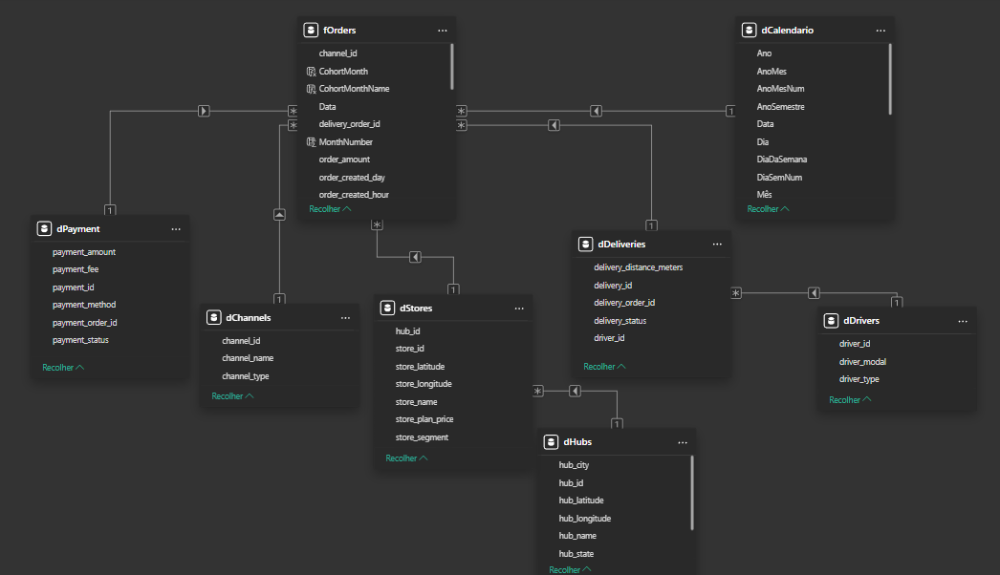
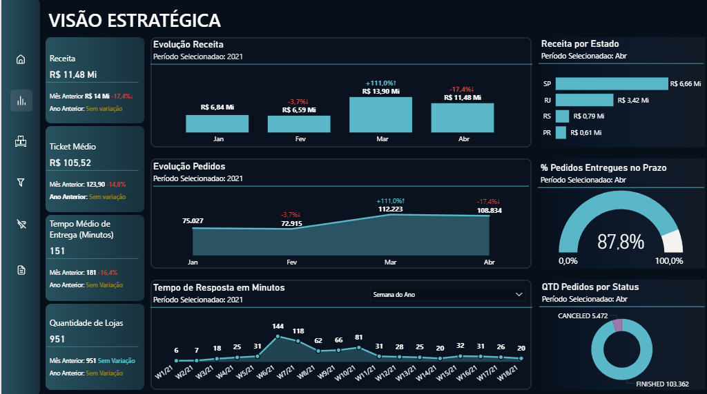
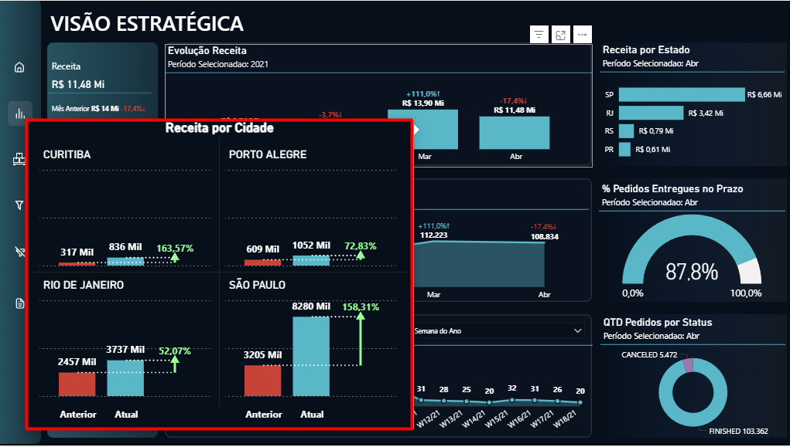
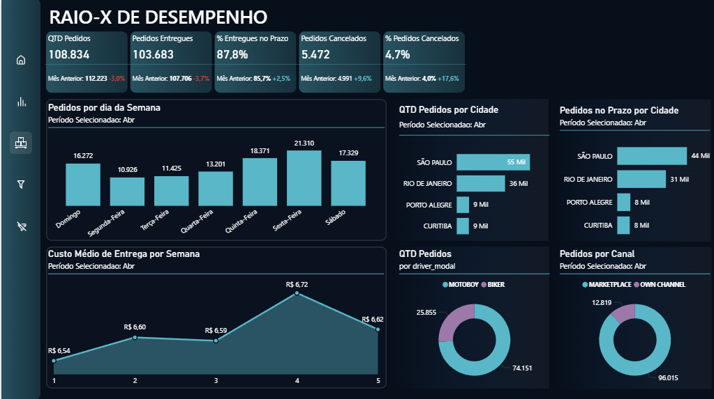

# ESTE DOCUMENTO VISA TRAQUEAR O PROJETO EM POWER BI FEITO PARA UMA EMPRESA DE CONSULTORIA.

Usando o VS Studio Code como IDE integrado com o Git e Github conectei o prower BI services ao github proporcionando um diretório remoto com o arquivo em Ppib(Projeto no Power BI).
Esta estrutura conjunta permite que varias pessoas trabalhem um uma branch de desenvolvimento sem alterar o projeto principal até que todas as mudanças sejam validadas, além de traquear e resgistrar todas as alterações e o autor delas. Proporcionando um melhor versionamento e produção do projeto.

## Objetivos

Definição do Problema: O problema foi apresentado sobre uma operação de Delivery Center com o objetivo de obter uma visão abrangente da operação, permitindo avaliar o desempenho, identificar melhorias e tomar decisões estratégicas. 

DESCRIÇÃO DOS CONJUNTOS DE DADOS:
- canais: Este conjunto de dados possui informações sobre os canais de venda (mercados) onde são vendidos os bens e alimentos de nossos lojistas.

- entregas: Este conjunto de dados possui informações sobre as entregas realizadas por nossos entregadores parceiros.

- drivers: Este conjunto de dados possui informações sobre os entregadores parceiros. Eles ficam em nossos hubs e toda vez que um pedido é processado, são eles que fazem as entregas na casa dos consumidores.

- hubs: Este conjunto de dados possui informações sobre os hubs do Delivery Center. Entenda que os Hubs são os centros de distribuição dos pedidos e é dali que saem como entregas.

- Orders: Este conjunto de dados possui informações sobre as vendas processadas através da plataforma do Delivery Center.

- Payments: Este conjunto de dados possui informações sobre os pagamentos realizados ao Delivery Center.
store: Este dataset possui informações sobre os lojistas. Eles usam a Plataforma do Delivery Center para vender seus itens (bom e/ou comida) nos marketplaces.

Limpeza e Preparação de Dados: 
A tabela fato de pedidos(orders) foi o foco central da limpeza e tratamento dos dados. Após uma analise exploratório feita em python apenas para entendimento básico do conjunto, foram identificados valores nulos em algumas colunas.

```bash
order_id                                  0
store_id                                  0
channel_id                                0
payment_order_id                          0
delivery_order_id                         0
order_status                              0
order_amount                              0
order_delivery_fee                        0
order_delivery_cost                    7205
order_created_hour                        0
order_created_minute                      0
order_created_day                         0
order_created_month                       0
order_created_year                        0
order_moment_created                      0
order_moment_accepted                  9461
order_moment_ready                    25106
order_moment_collected                42894
order_moment_in_expedition            67429
order_moment_delivering               25316
order_moment_delivered               349398
order_moment_finished                 15599
order_metric_collected_time           51492
order_metric_paused_time              71405
order_metric_production_time          25107
order_metric_walking_time             74056
order_metric_expediton_speed_time     34582
order_metric_transit_time             25857
order_metric_cycle_time               15619
dtype: int64
```
Analise em porcentagem.
```bash
order_id                              0.000000
store_id                              0.000000
channel_id                            0.000000
payment_order_id                      0.000000
delivery_order_id                     0.000000
order_status                          0.000000
order_amount                          0.000000
order_delivery_fee                    0.000000
order_delivery_cost                   1.952580
order_created_hour                    0.000000
order_created_minute                  0.000000
order_created_day                     0.000000
order_created_month                   0.000000
order_created_year                    0.000000
order_moment_created                  0.000000
order_moment_accepted                 2.563964
order_moment_ready                    6.803812
order_moment_collected               11.624422
order_moment_in_expedition           18.273491
order_moment_delivering               6.860723
order_moment_delivered               94.688061
order_moment_finished                 4.227383
order_metric_collected_time          13.954509
order_metric_paused_time             19.351001
order_metric_production_time          6.804083
order_metric_walking_time            20.069431
order_metric_expediton_speed_time     9.371841
order_metric_transit_time             7.007336
order_metric_cycle_time               4.232803
dtype: float64
```
Tatramentos realizados:
- Descartamos o uso da coluna order_moment_delivered para qualquer analise e usamos a order_moment_finished que tem a mesma estrutura, dados e a diferença de tempo entre elas é minima.
- order_metric_collected_time | order_metric_paused_time | order_metric_production_time | order_metric_walking_time | order_metric_expediton_speed_time | order_metric_transit_time | order_metric_cycle_time  Nas colunas citadas substituimos os valores nulos por 0 entendendo que não ouveram movimentações na operação, contudo, o valor nulo foi representado como 0.
- Todas as colunas de ID foram transaformadas para o tipo de dados Texto afim de evitar problemas.
- Dupliquei a coluna oder_momento_created afim de transformar o formato para data e fazer a conexão com a tabela dCalendário.
- Nas outras tabelas fiz tratamentos simples como: Remoção de duplicatas, ajustes de tipos de dados e etc..

Modelagem: A modelagem escolhida foi a esquema estrela pela estrutura dos dados já muito bem definidas e prontas para utilizar-la. Com duas modelagens Snowflack antre dStories-dHubs e dDeliveries-dDrivers.
A Modelagem abaixo nos permite relacionar os dados em várias dimensões proporcionando a possibilidade de analise bem avençadas. 



Avaliação: Avalio que o desafio permite que o analista em questão possa fazer muitas analises e demosntrar sua capacidade de tranformar dados em descisões de forma bem aprofundada.

Comunicação: O resultado foi uma visualização completa com todos os requisitos solicitados no teste com over deliveries. Como podemos ver nas imagens abaixo:

- Capa
 

- Visão Estratégica 
 

- Visão Estratégica - Tooltip - Receita por Cidade comparativo mês atual vs Mês anterior
  

- Desempenho 
  

  # [Acesse o Relatório aqui!](https://app.powerbi.com/view?r=eyJrIjoiY2VhNjY4MmYtNDIzZC00MDU1LTgwMjUtYTViMDdlNGViYzNiIiwidCI6ImY1YWQzMWRlLTdiMWQtNDFmNC1hYzJiLTM3Zjk0NWE4OGIyYyJ9)